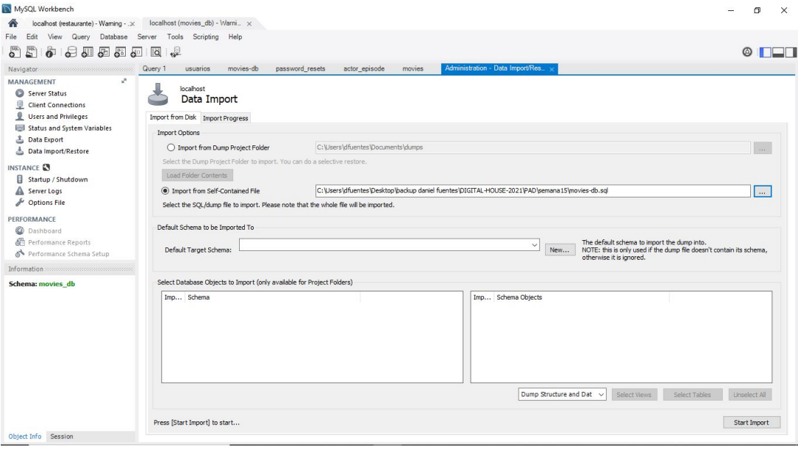

# Manipulación y consulta de datos

## Objetivo
Terminada la parte de diseño de nuestra base de datos y sus tablas, queda ahora llenarlas de datos que tengan utilidad y empezar a hacer consultas.
Para ahorrar algunos pasos, preparamos una base de datos de películas y series para tener una fuente de datos. Podemos descargar el script haciendo click acá, recordemos que va a ser necesario que importarlo y ejecutarlo en Workbench o algún programa similar. A continuación, planteamos diferentes consultas para realizar sobre la base de datos que descargamos.

## Ubicación -> Programación/TRABAJOS PRACTICOS/Manipulación y consulta de datos